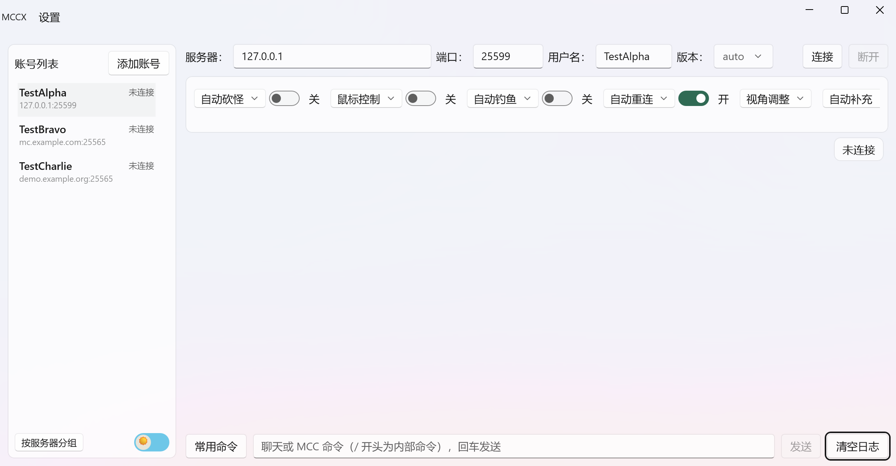
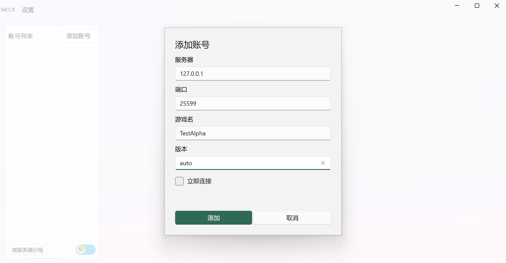
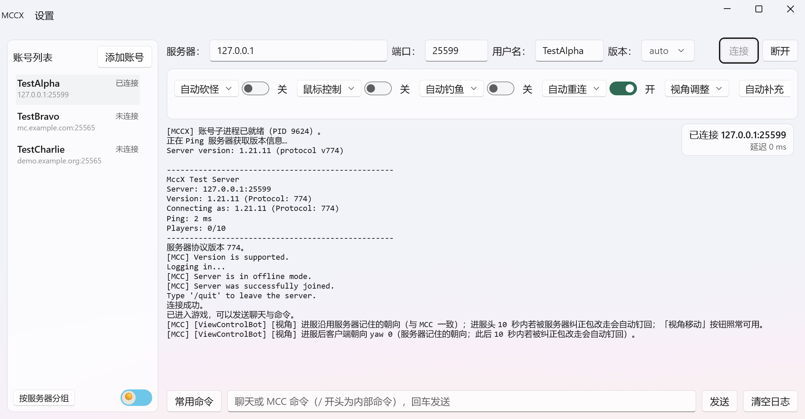
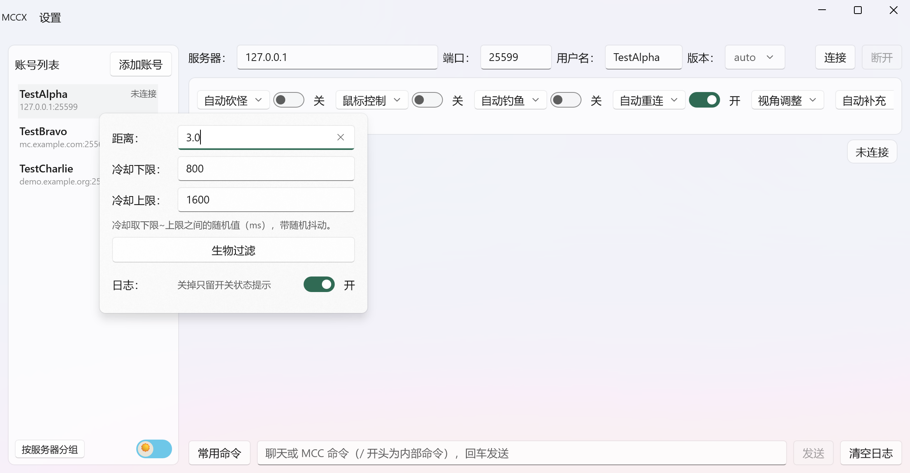
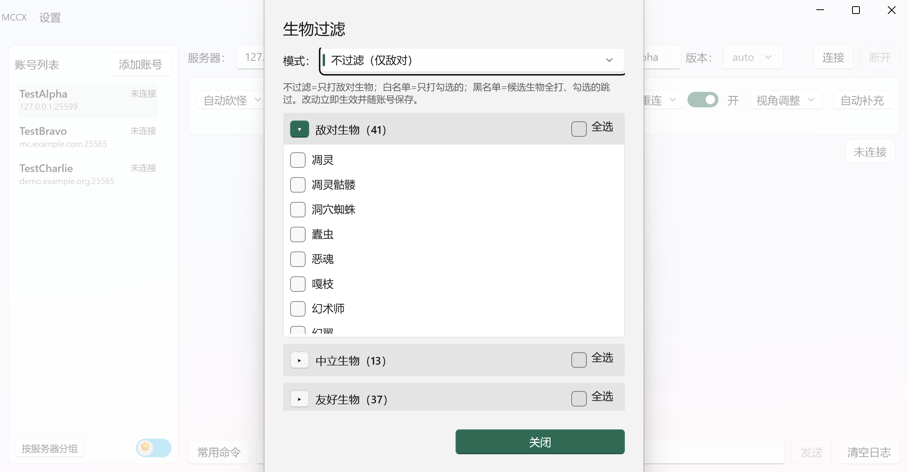
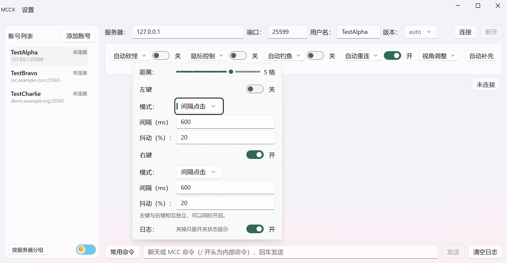
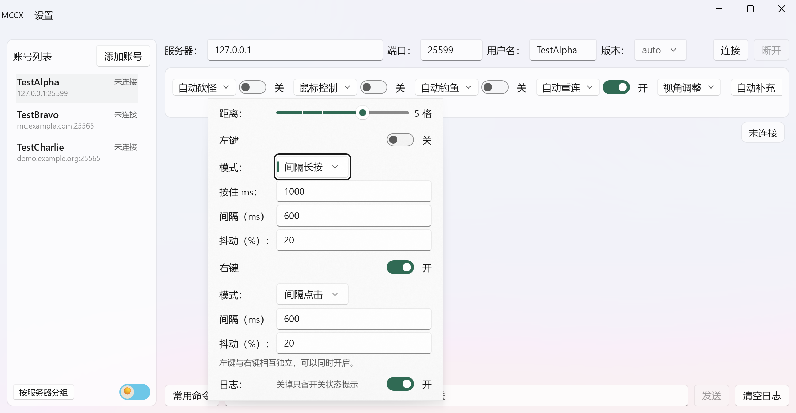
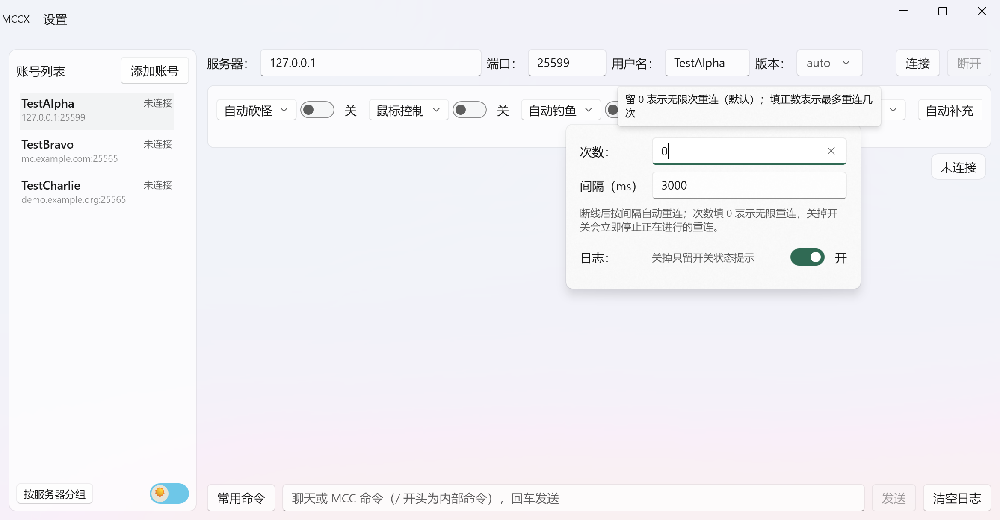
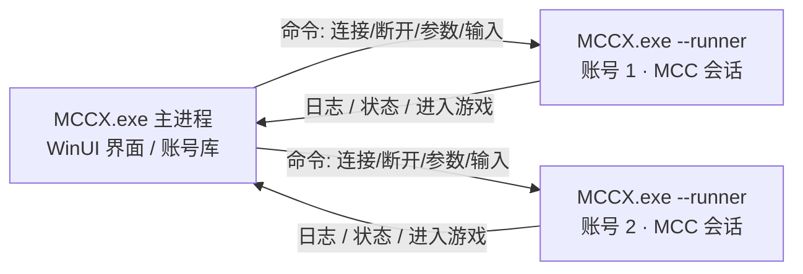

# MCCX — Minecraft 多账号挂机控制台

基于 [Minecraft Console Client](https://github.com/MCCTeam/Minecraft-Console-Client)（MCC）二次开发的 Windows 桌面挂机工具：
**多账号多开、可视化参数面板、自动化挂机**（自动砍怪 / 鼠标按键控制 / 自动钓鱼 / 自动重连 / 视角调整 / 自动补充 / 自动行走），界面为 WinUI 3（Windows 11 风格）。



---

## 目录

- [功能特性](#功能特性)
- [运行环境与启动](#运行环境与启动)
- [快速上手](#快速上手)
- [参数面板详解](#参数面板详解)
  - [自动砍怪](#自动砍怪)
  - [鼠标控制](#鼠标控制)
  - [自动钓鱼](#自动钓鱼)
  - [自动重连](#自动重连)
  - [视角调整](#视角调整)
  - [自动补充](#自动补充)
  - [自动行走](#自动行走)
  - [服务器信息过滤](#服务器信息过滤)
- [日志与命令](#日志与命令)
- [多开与进程模型](#多开与进程模型)
- [数据与安全](#数据与安全)
- [常见问题](#常见问题)
- [开发者说明](#开发者说明)

---

## 功能特性

- **多账号多开**：左侧账号列表一键切换，每个账号一个独立进程，互不干扰；一个账号挂一个服。
- **可视化参数**：砍怪 / 鼠标 / 重连等参数全部在面板上改，改完即下发，不用碰配置文件。
- **自动砍怪**：攻击距离、冷却随机抖动、91 种生物三分类过滤（敌对 41 / 中立 13 / 友好 37）。
- **鼠标按键控制**：左键（挖掘/攻击）与右键（放置/使用）完全独立、可同时开；三档模式 + 准星探测距离（1-7 格）+ 随机抖动。
- **自动钓鱼**：复用 MCC 内置 AutoFishing，开箱即用。
- **自动重连**：默认**无限次**重连（次数填 0），也可指定上限；关掉开关会**立即停止**正在进行的重连。
- **视角调整**：进服 / 重生后把视角恢复到上次退出时的方向（服务器默认会把视角重置为正南）；弹层里另有 6 个方向按钮，点一下转一次身。
- **自动补充**：快捷栏手上的物品用完、放完或损坏时，自动从背包把同类物品补回手上。
- **自动行走**：一直朝当前朝向前进，配合「视角调整」的方向按钮换向。
- **服务器信息过滤**：按方式屏蔽服务器刷屏消息（全屏蔽 / 屏蔽玩家消息 / 只显示·只屏蔽指定前缀），只管服务器消息进不进日志，连接提示与 Bot 日志照常。
- **账号列表管理**：「按服务器分组」把同一服务器的账号归进一个组（组头显示域名）；列表底部还有**暗色模式**开关（月亮 / 太阳小图标），界面配色随程序记忆。
- **服务器对话框**：服务器弹出登录 / 密码框时界面同步弹窗填写——密码框遮蔽输入，取值直接回写 MCC，**不进日志、不会被当聊天发出去**。
- **日志体验**：连续重复日志自动合并成 `xN`（`xN` = 这条内容累计出现 N 次），新日志自动滚到最新；日志里的网址带下划线提示，**Ctrl + 左键**一键打开；底部输入框直接聊天或敲 MCC 命令。
- **过程日志可过滤**：砍怪 / 鼠标 / 钓鱼等每个功能的逐条过程日志，都能在各自参数弹层里单独关掉（`自动砍怪日志`、`鼠标控制日志`…），只留开启 / 关闭状态提示，日志更干净。
- **设置菜单**：标题栏 `MCCX` 旁有纯文字「设置」菜单，内含 **Debug 模式** 开关——平时保持关闭；排查连接问题时打开，日志里才会出现网络循环退出原因、包级收发等底层信息。
- **账号加密持久化**：账号库 AES 加密存在 exe 目录的 `UserData\` 文件夹，程序读取界面**永不回写** `MinecraftClient.ini`。

---

## 运行环境与启动

**系统要求**

| 项目 | 要求 |
| --- | --- |
| 操作系统 | Windows 10 1809+ / 11（64 位） |
| 运行时 | [.NET 10 桌面运行时（Desktop Runtime）x64](https://dotnet.microsoft.com/download/dotnet/10.0) + [Windows App Runtime x64](https://aka.ms/windowsappsdk/1/latest)（双击启动报缺框架时按提示装对应缺项） |
| 网络 | 能访问目标 Minecraft 服务器（Java 版） |

**从源码构建运行**

```powershell
# 需要 .NET 10 SDK（含 Windows 桌面工作负载）
dotnet build MCCX.slnx -c Release

# 构建产物（x64）
MCCX.App\bin\Release\net10.0-windows10.0.26100.0\win-x64\MCCX.exe
```

双击 `MCCX.exe` 即可启动（无需管理员权限）。首次运行会在 exe 同目录生成：

| 位置 | 文件 | 说明 |
| --- | --- | --- |
| exe 同目录 | `MinecraftClient.ini` | MCC 配置，启动时**只读**初始化（界面不会改写它） |
| exe 同目录 | `logs/` | MCC 会话日志 |
| exe 同目录 `UserData\` | `accounts.dat` / `accounts.key` | 加密账号库（密钥随机生成，删掉即清空账号） |
| exe 同目录 `UserData\` | `ui-settings.json` | 暗色模式、账号是否按服务器分组 |
| exe 同目录 `UserData\` | `frequent-commands.json` | 常用命令历史 |

账号库与配置类文件全部集中在 `UserData\` 文件夹里，**换新版时只需把这个文件夹拷进新版目录**（散落在 exe 根下的同名文件会在首次启动时自动搬进来）。

> 登录目前仅支持**离线模式**（填写任意用户名即可），目标服务器需允许离线登录。

---

## 快速上手

### 1. 添加账号

左侧标题栏点 **“添加账号”**，填写服务器、端口、用户名（版本默认 `auto` 自动协商），可勾选“立即连接”：



- **端口留空** = 自动：先查 `_minecraft._tcp` 的 DNS SRV 记录，查不到回退 `25565`。
- 要固定端口（如 `25565`、`25599`）直接填数字即可。
- 删除账号：悬停列表项点右侧 **✕**，二次确认后会关闭该账号进程并从账号库移除。
- 账号多了可用列表底部的 **“按服务器分组”** 收纳；同一台服务器（域名 / IP 相同）的账号归进一组，组头显示域名。

### 2. 连接 / 断开

选中账号 → 右上参数行点 **“连接”**。连接状态与延迟**浮在日志区右上角**（不占布局行、不挡鼠标选中）：

```
连接中… → 已连接 <主机>:<端口> → 断开中… → 未连接
```



- 点 **“断开”** = 踢下线并关闭该账号的子进程（等价于客户端正常退出）。
- 关闭整个窗口 = 断开**所有**账号并立即退出，不残留进程。

---

## 参数面板详解

功能卡片一排开关（未选中账号时右侧为空白页），一行放不下可左右滚动露出：

```
[自动砍怪 ▾] [开关]   [鼠标控制 ▾] [开关]   [自动钓鱼 ▾] [开关]   [自动重连 ▾] [开关]
[视角调整 ▾] [开关]   [自动补充 ▾] [开关]   [自动行走 ▾] [开关]   [服务器信息过滤 ▾] [开关]
```

带 `▾` 的点**文字**展开参数弹层，点开关只启停功能。

### 自动砍怪



| 参数 | 含义 |
| --- | --- |
| 距离 | 攻击距离（格），只打这个范围内的生物 |
| 冷却下限 / 上限 | 每次攻击间隔在下限~上限毫秒之间**随机取值**（防固定节奏） |
| 生物过滤 | 打开过滤弹窗（见下） |

冷却随机 + 目标过滤，避免“机器人式”匀速清屏。

**生物过滤**弹窗按 敌对（41）/ 中立（13）/ 友好（37）三类展开收起，支持分类全选；顶部“过滤模式”三选一：



| 过滤模式 | 行为 |
| --- | --- |
| 不过滤（仅敌对） | 只打敌对生物，中立/友好不碰（默认） |
| 白名单（只打勾选的） | 只攻击你勾选的生物 |
| 黑名单（勾选的不打） | 勾选的全部跳过 |

### 鼠标控制

左右键**完全独立**、可以同时开启，参数各用各的。



**距离（滑动条）**：准星探测距离 1-7 格，默认 5。左键挖/右键交互都只认准星方向这个距离内的方块，空处则挥手/用物品。

> ⚠️ 原版交互距离约 **4.5 格**：超过 4.5 的部分属于超距操作，部分服务器 / 反作弊插件会拒绝，建议按目标服实测调整。

**三档模式**（每个按键各自选择）：

| 模式 | 行为 | 显示的参数 |
| --- | --- | --- |
| 长按 | 一直按住不松手（左键=持续挖，右键=持续使用） | 只有抖动 |
| 间隔点击 | 每隔“间隔”毫秒瞬时点一下（**不看按住值**） | 间隔、抖动 |
| 间隔长按 | 每次按住“按住”毫秒，松开后再等“间隔”毫秒 | 按住、间隔、抖动 |

**按住 / 间隔行按模式显隐**——不生效的参数直接藏起来，避免误导：

- 长按 → `按住`、`间隔` 都隐藏；
- 间隔点击 → 只显示 `间隔`（`按住 ms` 是间隔长按的参数，隐藏且**不参与**点击节奏）；
- 间隔长按 → 两个都显示。



**抖动 %**：对间隔施加 ±N% 随机扰动（0-90），降低固定频率特征。

日志里可直接看到每次触发：

```
[鼠标] 已开启：左键 / 间隔点击每 600 ms 点一次…；右键 / …（探测距离 5 格）
[鼠标] 右键 点击（指向方块）
[鼠标] 破坏方块 stone（12, 64, -8）
```

嫌逐条刷屏，可在鼠标控制弹层里关掉 **「鼠标控制日志」**，只留开启 / 关闭状态；砍怪、钓鱼、重连等功能也各有自己的日志开关。

### 自动钓鱼

开关即用，无额外参数（**手中持有钓竿**）：复用 MCC 内置 **AutoFishing** Bot——开启后自动抛竿，通过**声音 + 浮漂运动**双通道检测咬钩，咬钩自动收竿并再次抛出，钓竿损坏时自动切换备用竿。

### 自动重连



| 参数 | 含义 |
| --- | --- |
| 次数 | 断线后最多自动重连几次；**填 0 = 无限重连（默认）** |
| 间隔 ms | 两次重连之间的等待毫秒数 |

> 关掉「自动重连」开关会**立即停止**正在进行的重连；开着时它会一直重试直到连上（次数为 0 时）。

### 视角调整

弹层里两块内容（点「视角调整」文字展开）：

| 项 | 行为 |
| --- | --- |
| 进服后恢复上次视角 | 进服 / 重生后把视角转回上次退出时的方向，并持续记录你转过的朝向（默认开） |
| 6 个方向按钮 | `视角向东` / `视角向南` / `视角向西` / `视角向北` / `视角抬头看天` / `视角低头看地`——点一下转一次；转到的方向同时作为下次进服的朝向 |

> 弹层**点方向按钮不会自己收起**，方便连点几个方向。

### 自动补充

快捷栏手上（当前选中格）的物品**用完 / 放完 / 工具损坏**时，自动从背包找同类物品补到手上：

- 优先从**主背包**（快捷栏上方那 3 格 × 9 列）找，没有再看其他快捷栏格；**副手不补**。
- 补货 = 两次左键（从源格拿起 → 放进空出的手持格），做完光标回到空闲状态。
- 守卫：光标上正拿着东西、或开着箱子 / 容器界面时**不动手**。

### 自动行走

开关即用，无参数：一直朝当前朝向前进。想换方向就点「视角调整」弹层里的方向按钮，它按新朝向继续走。

### 服务器信息过滤

管**服务器发来的消息**进不进日志——连接提示、Bot 日志、开关状态不受影响。过滤方式五选一：

| 方式 | 行为 |
| --- | --- |
| 不过滤 | 服务器消息全部照常显示（默认） |
| 全屏蔽 | 服务器消息一律不进日志 |
| 屏蔽玩家消息 | 滤掉玩家聊天，系统提示等照常 |
| 只显示指定前缀 | 只有命中前缀列表的消息显示 |
| 只屏蔽指定前缀 | 命中前缀列表的消息不显示 |

两个前缀列表各自独立保存：选「只显示指定前缀」用显示列表，选「只屏蔽指定前缀」用屏蔽列表，切换方式时各用各的、互不覆盖。

---

## 日志与命令

- **重复合并**：连续相同的日志不刷屏，就地合并为 `xN`；**`xN` 表示这条内容累计出现了 N 次**（首条不带后缀，出现第 2 条就变成 `x2`）。
- **选中与复制**：日志可以随意框选（支持跨行拖选），**右键 → 复制**复制选中的内容（没有选中时复制光标所在的整行）；点击日志只是定位光标，阅读位置不会乱跳。
- **点击链接**：带下划线的网址（`http(s)://…`、`www.…` 以及裸写的常见域名）**按住 Ctrl 点一下**即可在浏览器打开；一行里有多个网址时，点哪个开哪个。
- **过滤过程日志**：每个功能的逐条过程日志都能在自己的参数弹层里关掉（`自动砍怪日志`、`鼠标控制日志`、`自动钓鱼日志`、`自动重连日志`…），只留状态提示；服务器消息用「服务器信息过滤」。
- **底部输入框**：回车发送聊天；`/` 开头为 MCC 内部命令（如 `/inventory`、`/teleport`）。
- **命令历史**：输入框里按 **↑ / ↓** 翻历史（每个账号独立，最多 100 条，连续重复的不堆两条；翻过最新一条恢复正在打的半截输入）。
- **常用命令**：输入框左侧 **“常用命令”** 按钮——下拉里选一条**只填进输入框、不直接发送**，可手动添加、✕ 删除；`/` 开头的内部命令自动记录，`login` / `password` 等口令类命令一律不入库。
- **服务器对话框**：服务器弹出登录 / 密码对话框时，界面同步弹一个对话框填写，密码框遮蔽显示；取值直接回写 MCC，**不经过聊天框**。
- **清空日志**：只清当前账号的显示，不影响连接。

---

## 多开与进程模型

一个账号 = 一个独立的 MCC 会话子进程（同一个 `MCCX.exe --runner`），主进程只负责界面与调度，通过匿名管道收发命令与日志：



- 某个账号的子进程崩了只影响该账号，面板会提示“账号进程异常退出”，点“连接”可重新拉起。
- 主窗口关闭时按账号逐一发退出命令并等待回收（毫秒级），随后主进程直接结束。

---

## 数据与安全

- **账号库加密**：`accounts.dat`（密文）+ `accounts.key`（随机会话密钥）保存在 exe 目录的 `UserData\` 文件夹里，二者缺一不可读。
- **`.ini` 只读**：`MinecraftClient.ini` 仅启动时读取一次，界面上的任何操作都**不会**回写该文件。
- **密码不落地**：服务器对话框里的密码遮蔽输入，只回写给 MCC，不进日志、不进聊天、不进账号库以外的任何文件。
- **防封抖动**：攻击冷却随机区间、点击间隔 ±% 抖动都是为降低固定节奏特征设计的；**不保证**绕过任何反作弊，请遵守目标服务器规则、合理设置频率。
- **超距提醒**：鼠标距离 > 4.5 格属于超距，可能被服务器拒绝。

---

## 常见问题

**Q：端口该填什么？**
留空 = 自动（DNS SRV → 25565）；服务器给了固定端口就直接填。

**Q：连接超时 / 进不去？**
依次检查：版本选 `auto` 是否协商成功（看日志第一行协议版本）、服务器是否为 Java 版、是否允许离线登录、本机防火墙/代理是否放行。

**Q：服务器弹出登录 / 密码框？**
界面会同步弹一个对话框，在里面填写并提交即可；密码遮蔽显示，不会出现在日志或聊天里。

**Q：为什么“按住 ms”看不见了？**
当前模式不是“间隔长按”。按住时长只对间隔长按生效，长按与间隔点击下该参数无效，所以自动隐藏。

**Q：鼠标距离调到 6-7 没反应？**
先确认目标方块在准星直线上且服务器未拒收超距交互（原版约 4.5 格），可调回 5 以内对比。

**Q：想把界面调成深色？**
账号列表底部的月亮 / 太阳小开关就是暗色模式，配色状态随程序记忆。

**Q：关窗口后还有 MCCX.exe 进程？**
不应出现。若出现可反馈复现步骤（正常路径已按“发退出命令 → 等待 → 强杀兜底”三层回收）。

**Q：升级新版 / 换机器时账号怎么带过去？**
升级新版：把旧版目录里的 `UserData\` 文件夹整个拷进新版目录即可。
换机器或换 Windows 用户：`accounts.key` 由 DPAPI 绑定当前 Windows 用户加密，拷过去也解不开（会按空列表启动），需要在新机器上重新录入账号。

---

## 开发者说明

| 目录 | 说明 |
| --- | --- |
| `MCCX.App/` | WinUI 3 界面（MVVM：View / ViewModel 分离，UI 线程与 MCC 会话线程分离） |
| `MCCX.Core/` | 会话编排、自动化（砍怪/鼠标 Bot）、IPC、加密账号库 |
| `MCCSource/` | MCC 上游源码（只读参考，不直接修改） |
| `MCCX.SmokeTest/` | 冒烟测试工程 |
| `tests/` | 自动化测试（用例 + 套件，总入口 `tests/tools/Test-TestScripts.ps1`） |

- 界面文案为中文；MCC 上游的用户可见字符串沿用其 `Translations.resx`（英文）。
- 跨线程数据一律经 `DispatcherQueue` 回到 UI 线程，MCC 会话事件不直接触碰控件。
- 构建：`dotnet build MCCX.slnx -c Debug|Release`。
